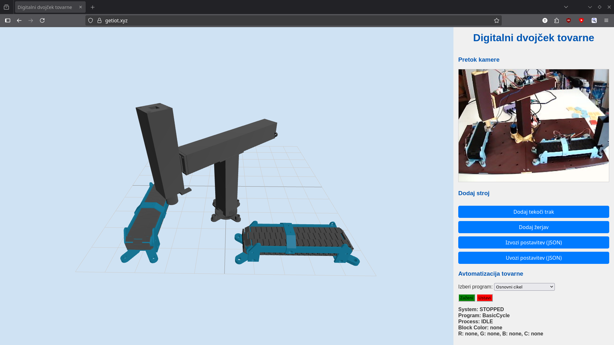

# Digitalni Dvojček Avtomatizirane Tovarne



Ta projekt predstavlja digitalni dvojček avtomatizirane tovarne, ki omogoča vizualizacijo in nadzor nad fizičnimi procesi v realnem času. Sistem uporablja MQTT za komunikacijo med digitalnim dvojčkom, strežnikom in fizičnimi napravami (npr. ESP32).

## Opis

Cilj projekta je ustvariti virtualno repliko proizvodne linije, kjer lahko uporabniki spremljajo delovanje strojev, preklapljajo med avtomatizacijskimi programi in celo ročno upravljajo določene komponente. To omogoča testiranje, optimizacijo in spremljanje tovarniških procesov v varnem virtualnem okolju, preden se spremembe implementirajo v fizični svet.

## Lastnosti

*   **Vizualizacija v realnem času:** 3D prikaz tovarne z uporabo Three.js, ki odraža stanje fizičnih strojev.
*   **MQTT integracija:** Brezhibna komunikacija med digitalnim dvojčkom, strežnikom Node.js in fizičnimi napravami preko MQTT protokola.
*   **Avtomatizacijski programi:** Podpora za različne avtomatizacijske cikle (npr. `BasicCycle`, `ColorSortingCycle`), ki jih je mogoče izbrati in zagnati preko uporabniškega vmesnika.
*   **Ročni nadzor:** Možnost ročnega upravljanja posameznih strojev (npr. transporterjev, žerjavov) preko nadzorne plošče v digitalnem dvojčku.
*   **Dinamična postavitev:** Dodajanje, premikanje in shranjevanje postavitve strojev v 3D sceni.
*   **Senzorika barv:** Zaznavanje barv blokov na transporterju in usmerjanje glede na barvo.

## Struktura projekta

*   `server.js`: Glavni strežnik Node.js, ki upravlja spletni strežnik, Socket.IO in MQTT komunikacijo.
*   `FactoryAutomation.js`: Vsebuje glavno logiko avtomatizacije tovarne, upravlja stanja sistema in delegira naloge avtomatizacijskim programom.
*   `config.js`: Konfiguracijska datoteka za MQTT posrednika, vrata strežnika in URL kamere.
*   `digital_twin/`: Vsebuje datoteke za 3D vizualizacijo digitalnega dvojčka (HTML, JavaScript, 3D modeli).
    *   `digital_twin/main.js`: Glavna logika Three.js za prikaz scene, interakcijo in povezavo s strežnikom.
    *   `digital_twin/FactoryManager.js`: Upravlja nalaganje in posodabljanje 3D modelov strojev.
    *   `digital_twin/models/`: Vsebuje 3D modele strojev (GLB format).
*   `automation_programs/`: Vsebuje različne avtomatizacijske programe.
    *   `automation_programs/BasicCycle.js`: Osnovni avtomatizacijski cikel.
    *   `automation_programs/ColorSortingCycle.js`: Avtomatizacijski cikel za sortiranje barvnih blokov.
*   `ArduinoCode/`: Vsebuje kodo za Arduino mikrokontrolerje, ki nadzorujejo fizične stroje.

## Namestitev

Za zagon projekta sledite tem korakom:

1.  **Klonirajte repozitorij:**
    ```bash
    git clone https://github.com/your-username/your-repo-name.git
    cd your-repo-name
    ```
2.  **Namestite odvisnosti Node.js:**
    ```bash
    npm install
    ```
3.  **Konfigurirajte MQTT in kamero:**
    Odprite `config.js` in posodobite `mqttBrokerUrl` z URL-jem vašega MQTT posrednika in `cameraStreamUrl` z URL-jem vašega MJPG pretočnega vira kamere (če ga uporabljate).
4.  **Zaženite strežnik:**
    ```bash
    node server.js
    ```
    Strežnik se bo zagnal na vratih, določenih v `config.js` (privzeto 3000).
5.  **Odprite digitalni dvojček:**
    Odprite spletni brskalnik in pojdite na `http://localhost:3000`.

## Uporaba

### Digitalni Dvojček

*   **Navigacija:** Uporabite miško za vrtenje, premikanje in povečevanje/pomanjševanje 3D scene.
*   **Dodajanje strojev:** Uporabite gumbe v meniju (npr. "Add Conveyor", "Add Crane") za dodajanje novih strojev v sceno. Pozvani boste, da vnesete MQTT teme za stanje in nadzor.
*   **Premikanje strojev:** Kliknite in povlecite stroje v 3D sceni, da jih premaknete. Stroji se bodo pripeli na mrežo.
*   **Rotacija strojev:** Med vlečenjem stroja pritisnite tipko `R` za rotacijo za 90 stopinj.
*   **Nadzorna plošča stroja:** Kliknite na posamezen stroj v 3D sceni, da odprete njegovo nadzorno ploščo, kjer lahko ročno upravljate njegove funkcije (npr. premikanje transporterja, upravljanje žerjava).
*   **Izvoz/Uvoz postavitve:** Postavitev tovarne lahko shranite v datoteko JSON ("Export Layout") in jo kasneje naložite ("Import Layout").

### Avtomatizacijski Nadzor

Na desni strani uporabniškega vmesnika boste našli avtomatizacijske kontrole:

*   **Izbira programa:** Izberite avtomatizacijski program iz spustnega menija (npr. "BasicCycle", "ColorSortingCycle").
*   **Zagon/Ustavitev:** Uporabite gumba "Start Program" in "Stop Program" za zagon in ustavitev izbranega avtomatizacijskega programa.
*   **Status avtomatizacije:** Spremljajte trenutno stanje avtomatizacijskega procesa v polju "Automation Status".

## Avtomatizacijski Programi

*   **BasicCycle:** Osnovni cikel, ki vključuje podajanje bloka na transporter, premikanje do prevzemne točke, prevzem z žerjavom in odlaganje na določeno mesto.
*   **ColorSortingCycle:** Naprednejši cikel, ki vključuje zaznavanje barve bloka (modra, rumena, neznana) in sortiranje blokov na različna odlagalna mesta glede na zaznano barvo.

## Tehnologije

*   **Backend:** Node.js, Express, MQTT.js, Socket.IO
*   **Frontend:** HTML, CSS, JavaScript, Three.js, Socket.IO client
*   **3D Modeli:** GLB format
*   **Komunikacija:** MQTT
*   **Fizični nadzor:** ESP32-C3 Supermini (koda je v `ArduinoCode/`)